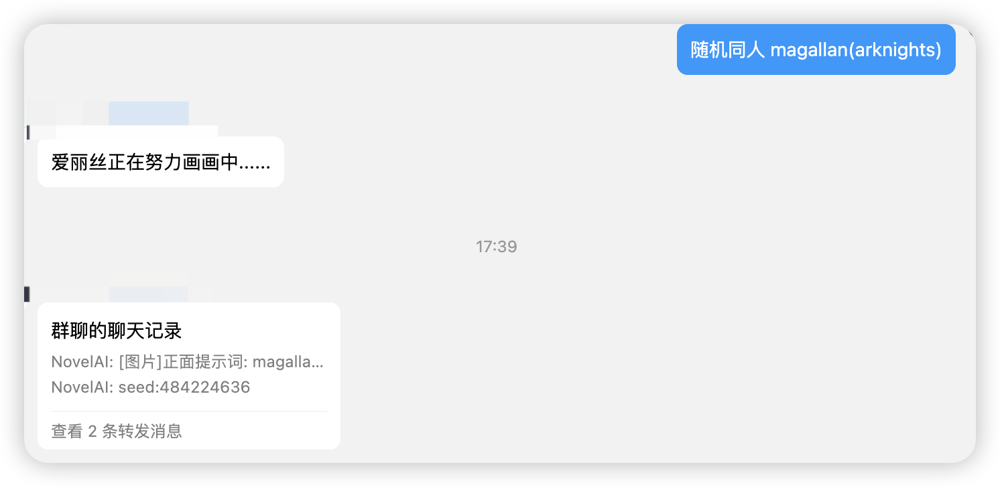
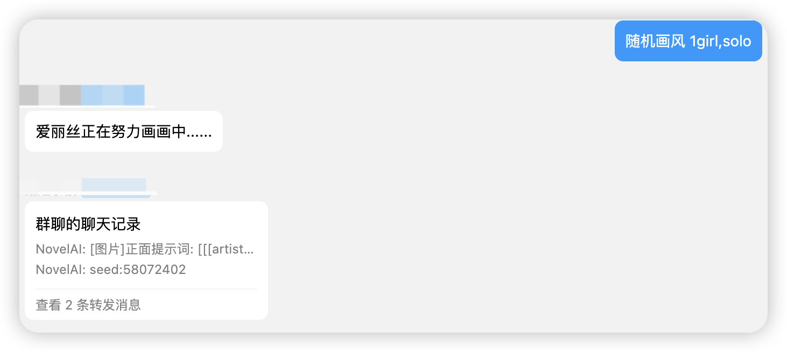

<div align="center">
  <a href="https://v2.nonebot.dev/store"></a>
  <br>
  <p></p>
</div>

<div align="center">

# nonebot-plugin-nai3-bot
</div>

# 介绍
- 本插件基于Claude3.5/GPT4+NovelAI V3/Stable Diffusion API,Bot在将自然语言转换为NAI3提示词并绘图发送的同时以自定义人格与用户聊天。
- 用户可以正常与指定人格（需要调教prompt,目前插件内置的人格为群友指定的BA角色天童爱丽丝）聊天。在聊天过程中可以使用自然语言描述AI绘图的需求,Bot会根据用户的聊天内容修改AI绘图所用的提示词（见效果图）,并且判断是否需要调用Novel V3模型/Stable Diffusion进行绘画。如果为正常聊天则不会触发绘画功能,如果Bot判断用户有AI绘画的需求,则会调用NAI3绘图,并将图片和提示词发送到群内。
- 每个用户和Bot有独立的聊天记录。
- 随机生成画师风格串绘图和随机同人图生成

# 注意
从1.3版本开始，人格提示词文件由json变成yaml格式，不再需要将提示词转换成base64格式，请根据[此处](#添加人格)的说明进行格式转换。
# 效果




# 安装
* 手动安装
  ```
  git clone https://github.com/Alpaca4610/nonebot_plugin_nai3_bot.git
  ```

  下载完成后在bot项目的pyproject.toml文件手动添加插件：

  ```
  plugin_dirs = ["xxxxxx","xxxxxx",......,"下载完成的插件路径/nonebot-plugin-nai3-bot"]
  ```
* 使用 pip
  ```
  pip install nonebot-plugin-nai3-bot
  ```
# 配置文件

在Bot根目录下的.env文件中追加如下内容：

必填内容：
```
nai3_token = "xxxx"  # NovelAI的token,与sd_api二选一
sd_api = "xxxxxx"    # stable diffusion的API地址，与nai3_token二选一。示例 http://{ip}:{port}/sdapi/v1/txt2img
oneapi_key = "sk-xxxxxxxxxx"  # （必填）OpenAI官方或者是支持OneAPI的大模型中转服务商提供的KEY
```

可选内容：
```
oneapi_url = "https://xxxxxxxxx"  # （可选）大模型中转服务商提供的中转地址,使用OpenAI官方服务不需要填写
oneapi_model = "gpt-4" # （可选）使用的语言大模型,建议使用Claude3.5模型以达到更好的体验效果
```
NAI3的token获取地址方法：


# 使用方法
- **  聊天内容/绘图需求      （**是触发与Bot对话的关键字）
- 记忆清除 : 清除当前用户的聊天记录
- 切换人格 : 切换机器人聊天的人格
- 随机画风 需要在画师串后面补充的正面提示词 : 随机生成NAI3的画师风格串进行绘图
- 随机同人 角色名称( 格式参考：magallan(arknights) ) : 随机生成指定角色的同人图，若不指定，则随机从预设角色列表中选择

# 可能存在的问题
- 由于调教prompt的原因，机器人可能会偶尔出错，此时继续和TA对话或者是使用记忆清除命令重新开始对话即可。
- 注意语言大模型的token消耗量
- 插件目前没有实现绘图排队提醒，多用户同时绘图NAI3可能会返回错误。
# 添加人格
1. 在机器人运行目录的`data`文件夹下创建文件`nai3_character.yaml`
2. 参考[人格信息模版](default_character.txt)，将模版中的第1部分修改成你的新人格和更改剩下部分的人格名称。
3. 参考[人格列表模版](nai3_character.yaml)，修改`nai3_character.yaml`文件。json文件的格式如下：
   ```yaml
   - name: 人格名称（用于切换人格时区分）
     nickname: 人格昵称
     prompt: |
      人格prompt，请参照默认人格模版，将模版default_character.txt中的第1部分修改成新人格和更改第2部分的出现的人格名称，再把内容复制到此处即可
      请注意缩进格式！
    ```

4. 发送切换人格，根据机器人的提示即可切换当前人格。若切换之前存在历史对话，清除聊天历史记录即可和新人格对话。

# TODO
- [x] 添加用户自定义人格功能
- [ ] 代理支持
- [ ] 支持绘图排队信息提醒(NAI3只支持一次出一张图)
